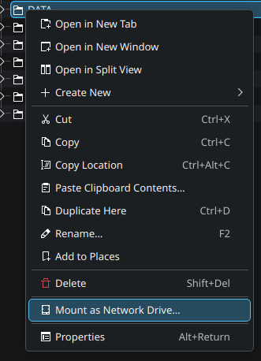
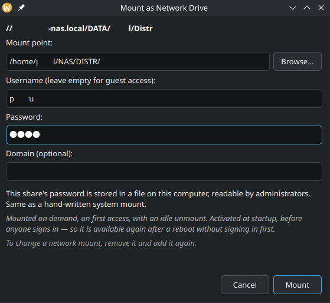
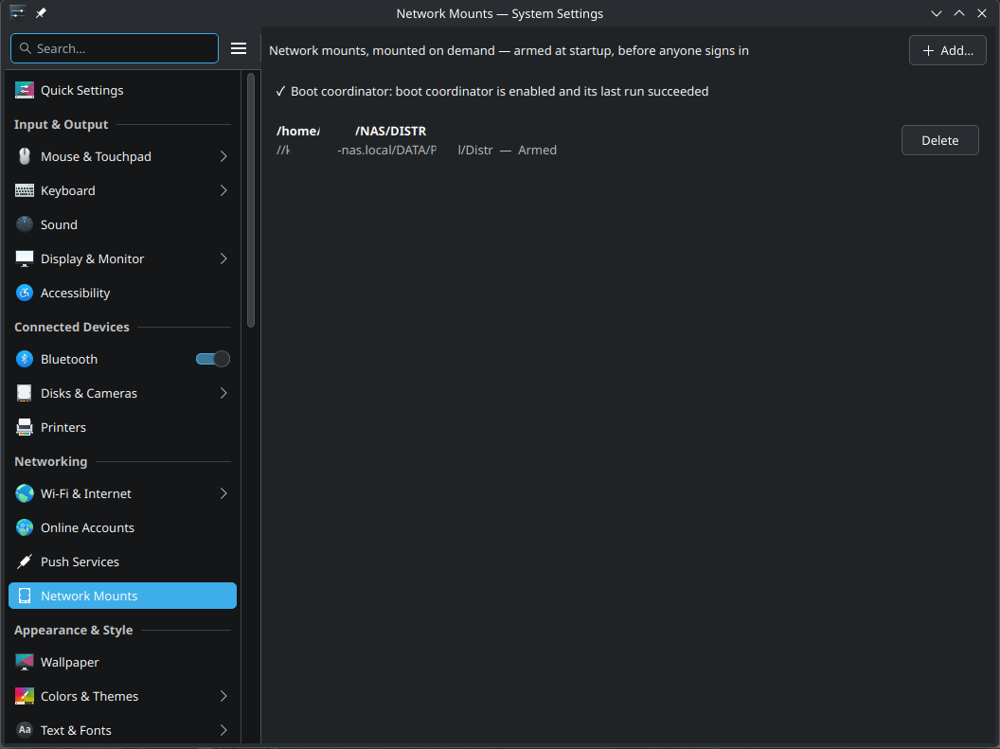

# KDE NAS Mount - easy network mounts without CLI hustle

Make your SMB network shares on your NAS or any other remote host easly connected to your Linux host with KDE Plasma desktop.

Requirements:
 - Kubuntu 26.04+ or Fedora 44+, **or**
 - KDE Plasma 6.0+ and Linux kernel 6.8+ on any other distro
 
## Downloads and Install

Download the latest package for your system with one command. Replace
`<version>` with the number shown on the
[latest release](https://github.com/pakru/kde_nasmount/releases/latest) — its
release notes carry the same commands with the version filled in.

Kubuntu 26.04 LTS amd64:

```bash
wget https://github.com/pakru/kde_nasmount/releases/latest/download/nasmount-amd64-<version>.deb
```

Fedora KDE 44 x86_64:

```bash
wget https://github.com/pakru/kde_nasmount/releases/latest/download/nasmount-fedora44-x86_64-<version>.rpm
```

Then install the downloaded package:

```bash
sudo apt install ./nasmount-amd64-<version>.deb                   # Kubuntu
sudo dnf install ./nasmount-fedora44-x86_64-<version>.rpm         # Fedora
```

`apt install` is preferred over `dpkg -i` for the `.deb`: it resolves the
package's dependencies, which `dpkg -i` leaves for you to install by hand.

### Upgrading

On Kubuntu, install the newer package over the installed one with the same
command:

```bash
sudo apt install ./nasmount-amd64-<newer>.deb
```

Your shares, their credentials, and your configuration are preserved — an
upgrade never touches `/etc/nasmount`, the generated units in
`/etc/systemd/system`, or `~/.config/nasmountrc`. Afterwards, restart System
Settings and Dolphin so they pick up the new KCM and service menu; nothing else
is needed, and no reboot is required.

On Fedora the same applies, with the same command:

```bash
sudo dnf install ./nasmount-fedora44-x86_64-<newer>.rpm
```

**Downgrades differ between the two, and not by choice.** The `.deb` refuses
them: run `nasmount-uninstall` first, then install the older package. The
`.rpm` cannot refuse — DNF downgrades whenever it is given an exact version,
which a local `.rpm` file is — so on Fedora an accidental `dnf install` of an
older package silently downgrades. Nothing protects you there; check the
version before you install it.








It mounts CIFS/SMB shares as real kernel mounts at **any path you choose**, using
generated static systemd `.mount`/`.automount` pairs. A share mounts **on demand**
— the first time a process opens its path — and the idle timeout releases it
while the trigger stays armed. A share's credential is a root-owned file that
survives reboot, and the trigger is armed at boot before anyone logs in — so a
saved share is simply there again after a restart, with nothing to re-enter and
nothing to arm by hand.

Two ways in, one backend — and now literally one dialog: **System Settings →
Network Mounts** to list, add and remove shares with live state for each, or
the **Dolphin service menu** (right-click an `smb://` share → **Mount as
Network Drive…**). Both render the same `ShareForm.qml`.


## Source-build requirements

A **Plasma 6+ / KF6+** desktop and **Linux 6.8+** (for `STATX_MNT_ID_UNIQUE`).

| Need | Debian/Ubuntu package |
|------|-----------------------|
| CMake ≥ 3.20, C++20 compiler | `cmake`, `g++` |
| Qt 6 Core / Widgets / Concurrent / Quick / QuickControls2 | `qt6-base-dev`, `qt6-declarative-dev` |
| Extra CMake Modules | `extra-cmake-modules` |
| KF6 Auth / I18n / WidgetsAddons / Config / CoreAddons / KCMUtils | `libkf6auth-dev`, `libkf6i18n-dev`, `libkf6widgetsaddons-dev`, `libkf6config-dev`, `libkf6coreaddons-dev`, `kf6-kcmutils-dev` |
| KF6 KIO, for the credential lookup described below | `libkf6kio-dev` |
| QtQuick / Controls / Dialogs / Layouts QML modules, to run the tests | `qml6-module-qtquick`, `qml6-module-qtquick-controls`, `qml6-module-qtquick-dialogs`, `qml6-module-qtquick-layouts` |
| `mount.cifs` at runtime | `cifs-utils` |
| KDE's password service at runtime, for credential autofill | `kio6` (Fedora: `kf6-kio-core`) |


## Build and install from source

```bash
make install           # or: ./install.sh — same thing
```

**Do not run this with sudo.** The build runs as you; only `cmake --install`
elevates, and the script refuses to start as root.

The prefix is **`/usr`**, not `/usr/local`: D-Bus only scans
`/usr/share/dbus-1/system-services` and polkit only
`/usr/share/polkit-1/actions`, so a `/usr/local` install would build fine and
then silently fail to authenticate.

This is a **clean install only** — there is no migration from an older version.
If one is installed, run `./uninstall.sh` first.

`make` builds into `build/` without installing; `make clean` removes it. The
shell scripts exist because they gate on the tests passing, refresh Dolphin's
and System Settings' caches, and enable the boot coordinator.

## Versioning and release artifacts

[`VERSION`](VERSION) is the single source of truth for the release version and
uses `MAJOR.MINOR.PATCH` format. CMake reads it as `PROJECT_VERSION`; the
command-line programs' `--version` output and the KCM plugin metadata are
generated from that value. A release bump therefore changes only `VERSION`.

Release tags use the matching `v<version>` form (for example, version `0.3.0`
uses tag `v0.3.0`). The release workflow rejects a tag whose value does not
match `VERSION`, rebuilds both native packages from that tag, smoke-installs
and removes them on their target distributions, verifies the two-package set,
generates checksums and a JSON release manifest, attests both packages, and
creates and publishes the GitHub Release.

For a release, change `VERSION`, commit it, push, and wait for regular
CI to pass. Then create the matching tag without entering the version again:

```bash
./packaging/tag-release.sh          # or add --sign when Git tag signing is configured
```

The helper requires a clean `master` whose current commit is already the
`origin/master` tip, validates `VERSION` and `packaging/RELEASE`, and refuses
an existing local or remote tag. It creates an annotated tag locally and
prints the exact `git push origin refs/tags/v<version>` command; it never pushes
on its own. Review the tag, run the printed command, and the tag push triggers
the release workflow.

The regular CI workflow has these required jobs:

1. `validate_packaging` — rootless source, shell, workflow, and package-metadata gates;
2. `build_deb` — unprivileged Ubuntu 26.04 build, all CTests, Lintian, and payload evidence;
3. `build_rpm` — unprivileged Fedora 44 build, all CTests, rpmlint, and payload evidence;
4. `smoke_packages` — clean-container install, payload inspection, and removal of seeded managed state for both targets;
5. `upgrade_deb` / `upgrade_rpm` — real in-place upgrade over seeded shares, then removal, for each family;
6. `verify_artifact_set` — exact payload/layout checks plus checksums and release metadata;
7. `ci_success` — one branch-protection result requiring every prior job.

Package creation deliberately uses `dpkg-buildpackage`/debhelper and
`rpmbuild`/Fedora RPM macros. The repository `make install` target is only for
interactive source installation and is never invoked to assemble a package.

## Credential autofill

When you open **Mount as Network Drive** on a share you are already signed in
to in Dolphin, the username and password fields arrive filled in. The
credential comes from KDE's own password service — the same one Dolphin used —
and never from reading a wallet file or storing anything new.

It is a suggestion, not a decision. Every field stays editable and masked, and
nothing is submitted for you: mounting still needs the same administrator
authentication as a credential you typed. As soon as you type in any of the
three credential fields, the whole suggestion is discarded rather than mixed
with what you entered, and clearing the username still means guest access.

Two things are worth knowing:

- **KDE may ask you to unlock your wallet** to answer. That prompt is KDE's,
  not this tool's. Declining it, having no wallet, or having no saved
  credential all end the same way: the form stays exactly as it was and you
  type the credential yourself.
- **It cannot prove which account a Dolphin tab is using.** KDE answers from
  what it has stored for the server and share, so on a server where you use
  more than one account, check the username before you mount. If the `smb://`
  URL names a user, a credential for any other account is refused rather than
  filled in.

Autofill runs only in the Dolphin service-menu dialog, where the share is
known from the URL. The System Settings **Add** form is unchanged and always
manual.

If the fields arrive empty and you expected otherwise, run the dialog from a
terminal to see why — a lookup that finds nothing says nothing by design:

```bash
NASMOUNT_DEBUG_LOOKUP=1 nasmount-dialog smb://host/share
```

It prints the reason, never any part of the credential.

Adding or removing a share requires **administrator authentication**
(`auth_admin`): it writes a persistent root-owned credential under `/etc` and a
unit that mounts before anyone signs in, which is the same authority as editing
`/etc` by hand. That prompt appears once per add or remove — never at boot, and
never while using a mounted share. Listing state is read-only and unauthenticated.

## Tests

```bash
make test              # or: ctest --test-dir build --output-on-failure
```

Eighteen test binaries plus shell, metadata, and AppStream gates; `install.sh`
runs every one and refuses to install if any fail. Both native-package builds
run the complete 24-test CTest suite. Privileged accept paths and real reboot /
no-login behaviour must still be validated in disposable target VMs.

## Uninstall

For a native package, run this as the desktop user who owns the shares:

```bash
nasmount-uninstall
```

An authenticated full purge: every managed share, its credentials and runtime
records, `~/.config/nasmountrc`, then the software itself. Mount points are
retained; tampered state or an unsafe live mount is refused, leaving everything
installed for retry. Add `--yes` to skip the confirmation prompt.

On Kubuntu it *purges* rather than removes, so `dpkg -l` stops listing nasmount
entirely. It reports what actually happened rather than assuming: if the
authenticated cleanup cannot be confirmed, it says so and leaves the package
installed, because a lost authorization reply cannot be distinguished from a
purge that already ran.

The command remains installed after the download is deleted. It authenticates
and purges managed state while the KAuth helper and polkit policy still exist,
then invokes `apt-get purge` or `dnf remove --no-autoremove` through `sudo`.

### Removing with apt or dnf directly

The two families behave differently here, deliberately.

**Kubuntu.** `apt remove` and `apt purge` both work with shares present, and
the package tears them down itself:

| Command | Effect |
|---|---|
| `sudo apt remove nasmount` | Disarms every managed share — stops its automount trigger and unmounts it — then removes the software. Unit files, credentials in `/etc/nasmount`, and runtime records are **kept**. |
| `sudo apt purge nasmount` | The above, and then deletes the unit files, `/etc/nasmount`, and `/run/nasmount*`. |

Two things this does **not** do, and cannot: it runs as root with no idea which
account owns a share, so it never removes anyone's `~/.config/nasmountrc`, and
it asks for no authentication. `nasmount-uninstall` remains the complete,
owner-scoped path — prefer it. If a share has open files, the unmount fails and
the removal prints a warning and continues, leaving that mount live until you
unmount it or reboot.

**Fedora.** RPM has no remove/purge split, so a single `dnf remove` does
everything the two apt commands do together: it disarms every managed share and
deletes its unit files, `/etc/nasmount`, and `/run/nasmount*`.

Always pass `--no-autoremove`:

```bash
sudo dnf remove --no-autoremove nasmount
```

Without it, DNF may continue removing dependencies it now considers unused,
which can leave other software on the system without Qt. `nasmount-uninstall`
passes it for you.

For an installation made from source, use:

```bash
./uninstall.sh
```

It reads `build/install_manifest.txt` and refuses to run without it, so
**source uninstall works only from the build tree that installed** — after
`make clean`, or in a fresh checkout, re-run `./install.sh` first.

## Author and licence

Written by **Pavel Krutikhin** ([@pakru](https://github.com/pakru)),
<krutikhin92@gmail.com>.

Copyright © 2026 Pavel Krutikhin. Licensed under the **GNU General Public
License, version 3 or later** (`GPL-3.0-or-later`); see [LICENSE](LICENSE) for
the full text.
