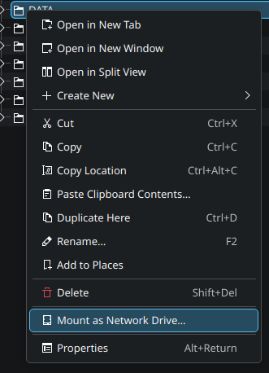
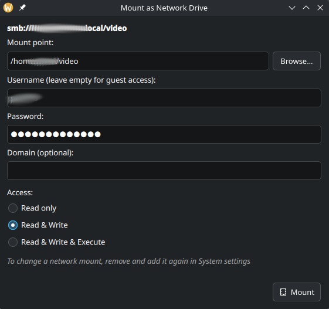
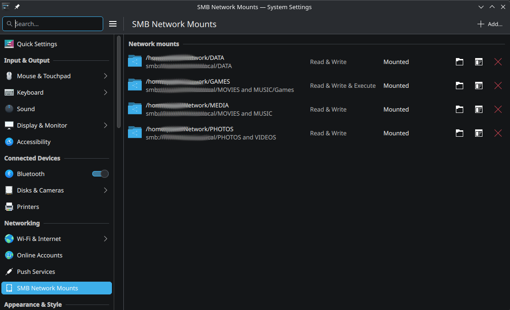

# KDE NAS Mount 

### Easy network mounts w/out CLI hustle for KDE
Make your SMB network shares easly connected to your KDE Plasma desktop.

Current builds suppor:
 - deb - Kubuntu 26.04+
 - rpm - Fedora 44+

Custom build:
 - KDE Plasma 6.0+ and Linux kernel 6.8+ on any other distro
 
## Downloads and Install

Download the latest package for your system with one command. Replace
`<version>` with the number shown on the
[latest release](https://github.com/pakru/kde_nasmount/releases/latest) — its
release notes carry the same commands with the version filled in.

Kubuntu 26.04 LTS amd64:

```bash
wget https://github.com/pakru/kde_nasmount/releases/latest/download/nasmount-amd64-<version>.deb
```

Fedora KDE 44 x86_64:

```bash
wget https://github.com/pakru/kde_nasmount/releases/latest/download/nasmount-fedora44-x86_64-<version>.rpm
```

Then install the downloaded package:

```bash
sudo apt install ./nasmount-amd64-<version>.deb                   # Kubuntu
sudo dnf install ./nasmount-fedora44-x86_64-<version>.rpm         # Fedora
```







## Source-build requirements

A **Plasma 6+ / KF6+** desktop and **Linux 6.8+** (for `STATX_MNT_ID_UNIQUE`).

On Kubuntu 26.04, install the packages needed to build, test, and run it:

```bash
sudo apt update
sudo apt install \
  appstream cifs-utils cmake diffutils extra-cmake-modules findutils g++ git make \
  libkf6auth-dev libkf6config-dev libkf6coreaddons-dev libkf6i18n-dev \
  libkf6kcmutils-dev libkf6kio-dev libkf6widgetsaddons-dev polkitd \
  qml6-module-org-kde-kcmutils qml6-module-org-kde-kirigami \
  qml6-module-qtquick qml6-module-qtquick-controls qml6-module-qtquick-dialogs \
  qml6-module-qtquick-layouts qt6-base-dev qt6-declarative-dev systemd
```

On Fedora KDE 44, use:

```bash
sudo dnf install \
  appstream cifs-utils cmake diffutils extra-cmake-modules findutils gcc-c++ git make \
  kf6-kauth-devel kf6-kcmutils kf6-kcmutils-devel kf6-kirigami \
  kf6-kconfig-devel kf6-kcoreaddons-devel kf6-ki18n-devel kf6-kio-devel \
  kf6-kwidgetsaddons-devel polkit qt6-qtbase-devel qt6-qtdeclarative \
  qt6-qtdeclarative-devel systemd
```

## Build and install from source

```bash
make install
```
or
```bash
./install.sh        
```

## Author and licence

Written by **Pavel Krutikhin** ([@pakru](https://github.com/pakru)),
<krutikhin92@gmail.com>.

Copyright © 2026 Pavel Krutikhin. Licensed under the **GNU General Public
License, version 3 or later** (`GPL-3.0-or-later`); see [LICENSE](LICENSE) for
the full text.
